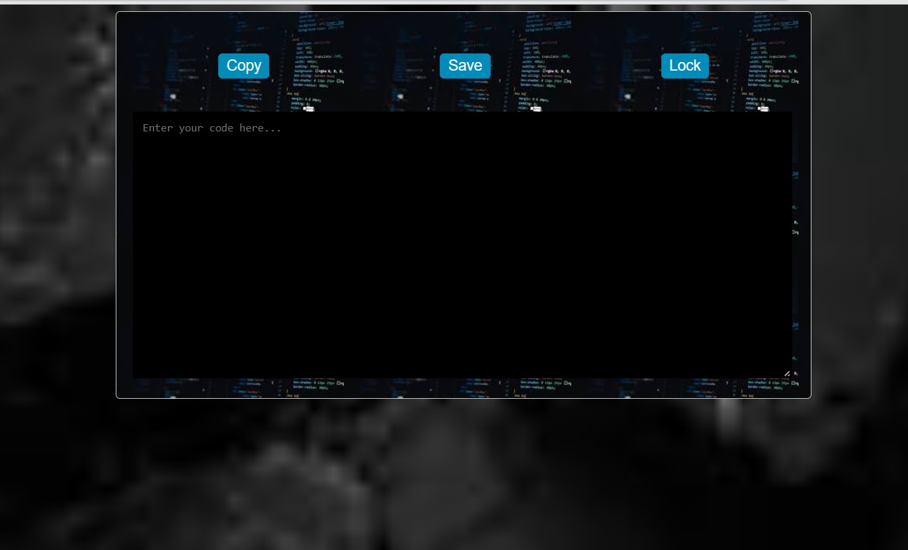

Code Editor Web App
The Code Editor Web App is a user-friendly online tool for writing, editing, and managing your code efficiently. This web application provides essential features for coding, such as syntax highlighting, code copying, saving, locking, and responsive design.

Key Features
Code Editing: Write and edit your code using syntax highlighting for various programming languages.
Copy Code: Easily copy your code to the clipboard with a single click.
Save Code: Save your code for future reference or sharing, either locally or remotely.
Lock/Unlock Editor: Lock the editor to prevent accidental changes and unlock it when you need to make edits.
Responsive Design: Enjoy a seamless code editing experience across different devices, from desktops to mobile phones.
Basic Indentation: The editor supports basic code indentation, maintaining code structure.
Getting Started
Prerequisites
All you need is a modern web browser (e.g., Chrome, Firefox, Safari) to use the Code Editor Web App.

Usage
Access the web app by opening the index.html file in your preferred web browser.

Start writing or pasting your code in the code editor area.

Utilize the "Copy" button to quickly copy your code to the clipboard for sharing or pasting into other applications.

If you want to save your code, click the "Save" button, and it will be stored for future reference.

To prevent any unintended changes, you can lock the editor by clicking the "Lock" button. To unlock it for further editing, simply click "Unlock."

Development
If you wish to contribute or make modifications to this project, follow these steps:

Clone the repository to your local machine using Git:

sh
Copy code
git clone https://github.com/yourusername/code-editor-app.git
Make your desired changes, add new features, or address issues.

Commit your changes with descriptive commit messages.

Push your changes to your GitHub repository.

If you'd like to contribute to the original project, create a pull request.

License
This project is open-source and is licensed under the MIT License. You can find the full license details in the LICENSE file.

In the above example, replace "yourusername" with your actual GitHub username. This "README" provides an overview of your Code Editor web app, its features, and how to use, develop, and contribute to the project.